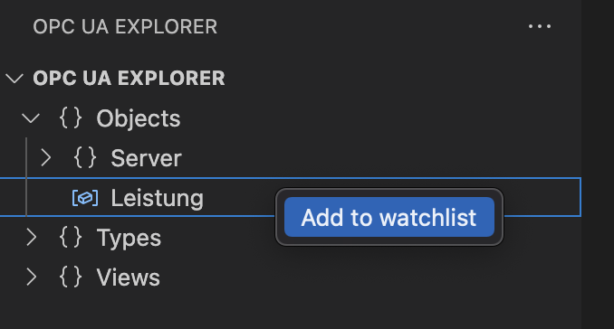
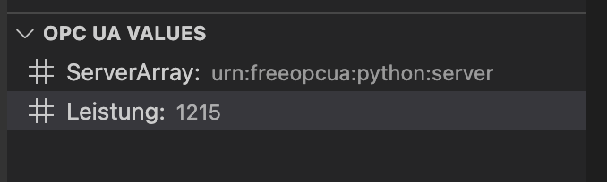

# vscode-opcua

VS Code OPC UA provides a simple interface to connect VS Code to an OPC UA Server.

*Warning: This is a pre-alpha version. It will probably not run stable and still lacks many fundamental features at this development stage!*

## Features

Connect to an OPC UA Server, browse files and add variables to your watchlist.

  
   

## Getting started

1. Use the `Connect to an OPC UA server` command
2. enter hostname and port
3. Disconnect with the `Disconnect from an OPC UA server` command

## Release Notes

### 0.1.0

- Added basic connection funcionality
- Browse OPC UA Nodes
- Add variables to watchlist and read values
